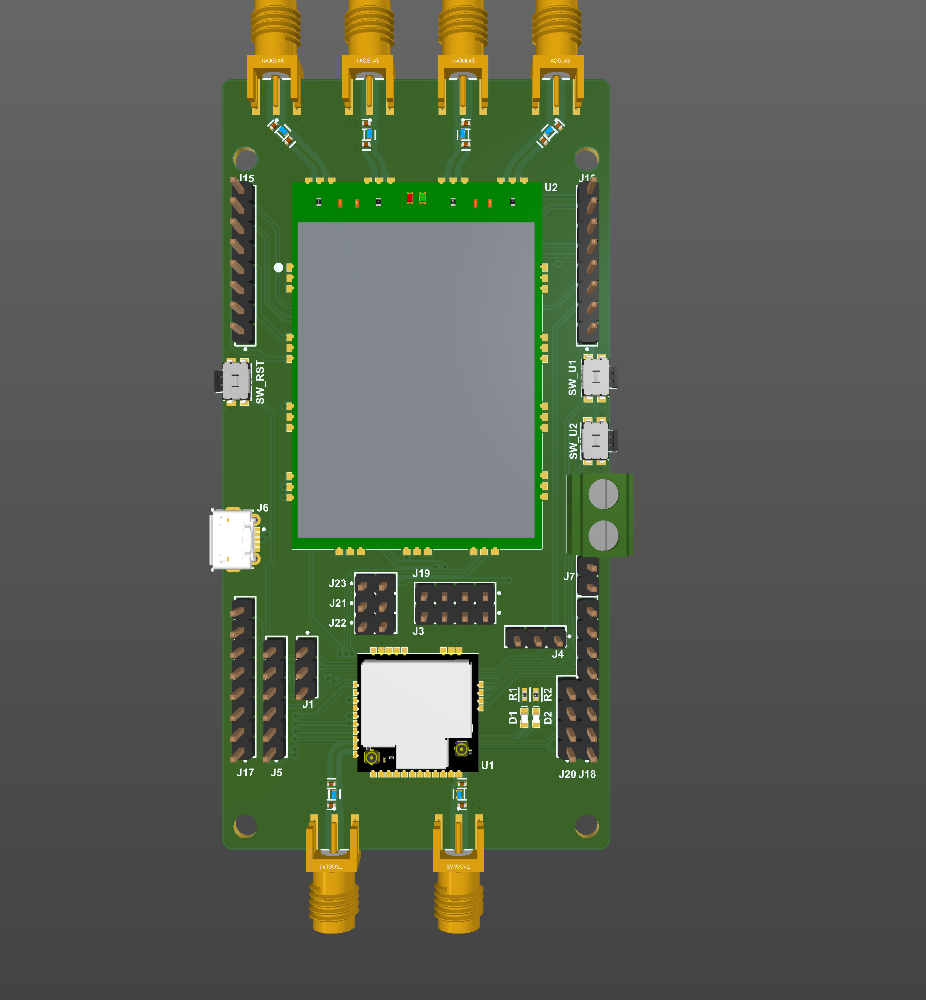
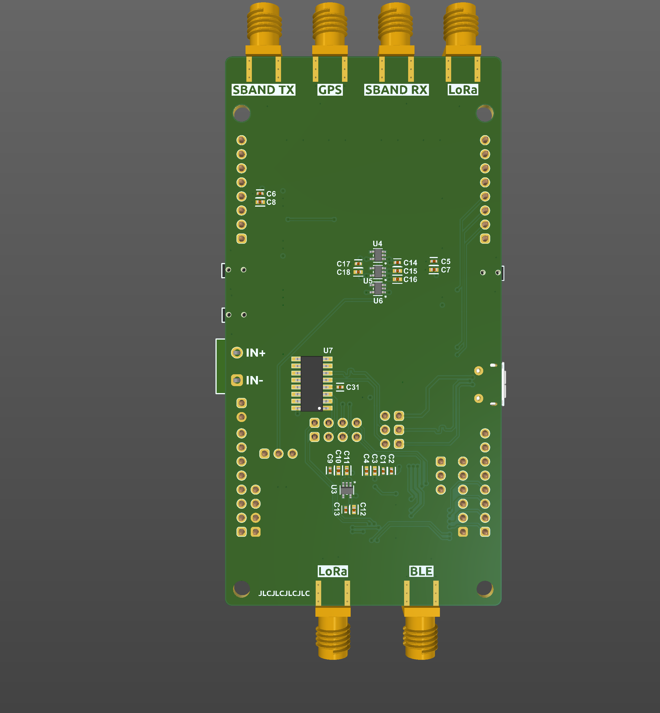
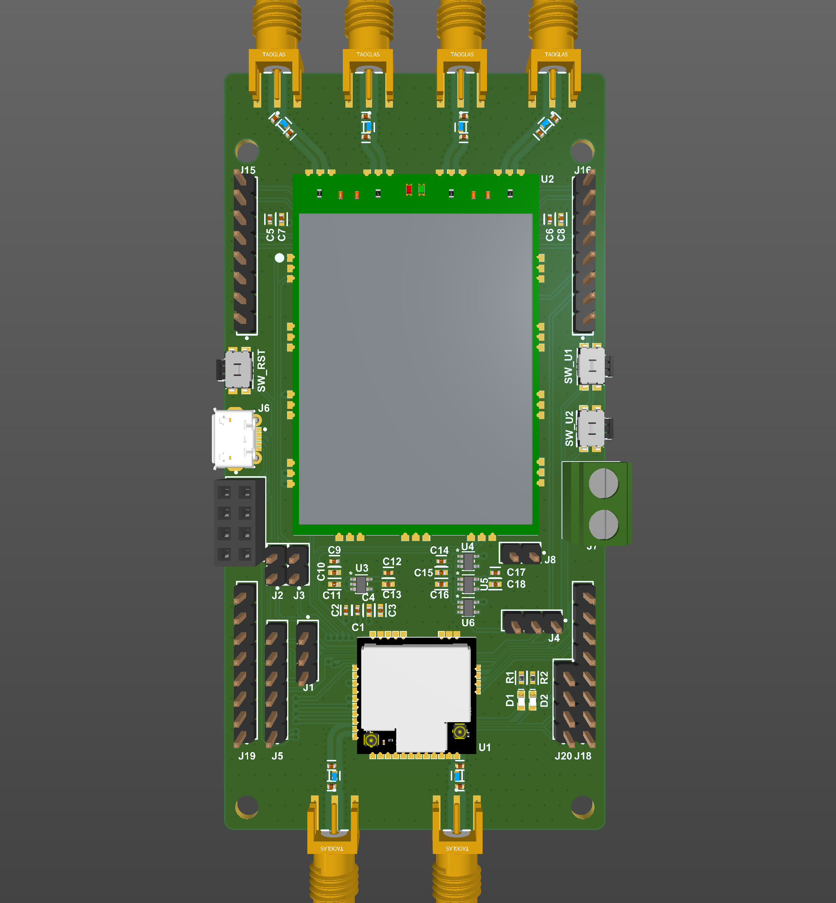
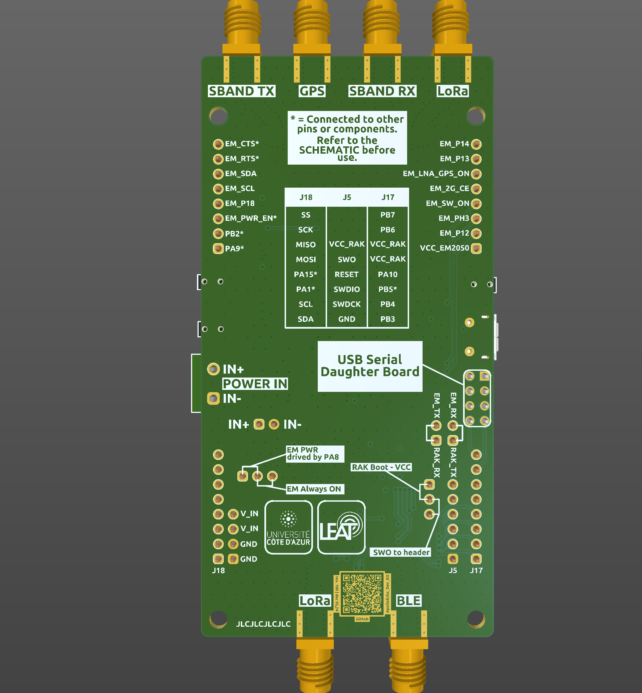
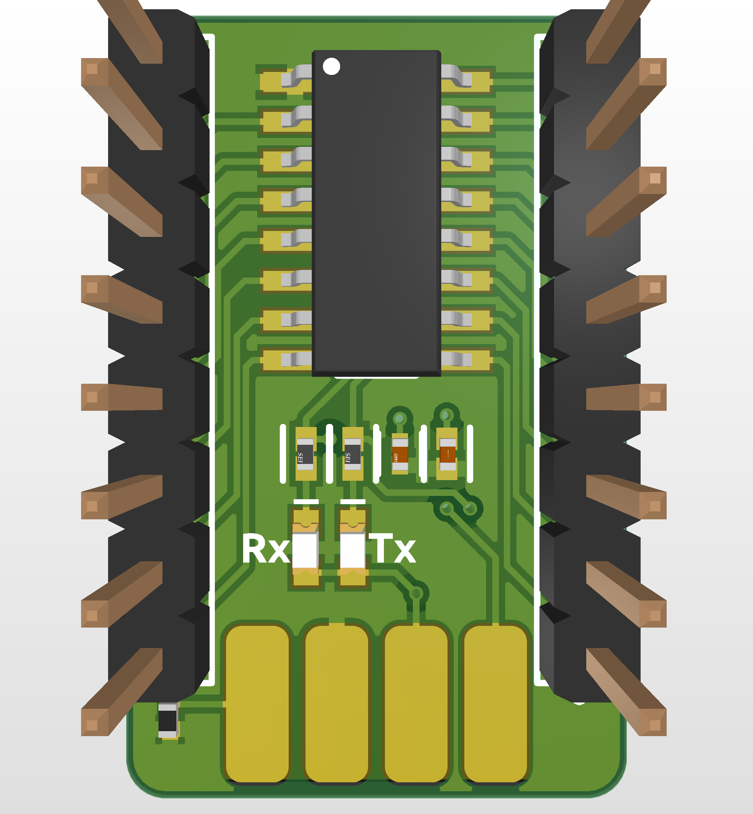
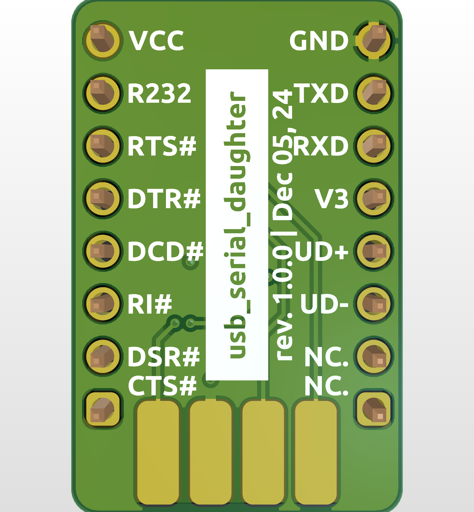

# ApolloEcho Dev Kit

This repository contains the PCB designs, related documents, and source code for the **ApolloEcho Dev Kit**.

The **ApolloEcho Dev Kit** includes two primary components: the **RAKwireless RAK11720** and the **EchoStar Mobile EM2050**. It is designed to provide a rapid and efficient approach to getting started with the EchoStar Mobile satellite network. All pinouts for the two modules are available in standard 2.54mm headers. The antenna is fully customizable via 6 SMA connectors.

## Rev 200 (Version 2.0.0)

### Changelog

- Add integrated CH340C USB TTL IC
- Integrated USB TTL IC can interact with both RAK11720 and EM2050

|                        Top View                        |                        Bottom View                        |
| :----------------------------------------------------: | :-------------------------------------------------------: |
|  |  |

## Rev 100 (Version 1.0.0)

### Overview

The kit includes a separate CH340C on a USB Serial Daughter Board. For programming and debugging, the USB Serial Daughter Board provides a simple connection via Micro USB. For battery-powered deployments that require low power, removing the USB Serial Daughter Board can improve autonomy.

|                        Top View                        |                        Bottom View                        |
| :----------------------------------------------------: | :-------------------------------------------------------: |
|  |  |

|                        Top View                         |                        Bottom View                         |
| :-----------------------------------------------------: | :--------------------------------------------------------: |
|  |  |

### Known issues

- The USBSerial Daughter board is not working.
- The SMA connectors are too close to each other.
- The QR code on the bottom is open in the paste layer. It's unscannable on the final board due to the soldering tin.

---
